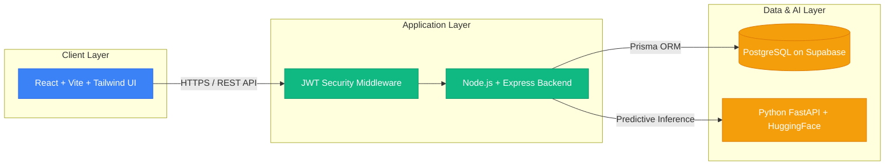
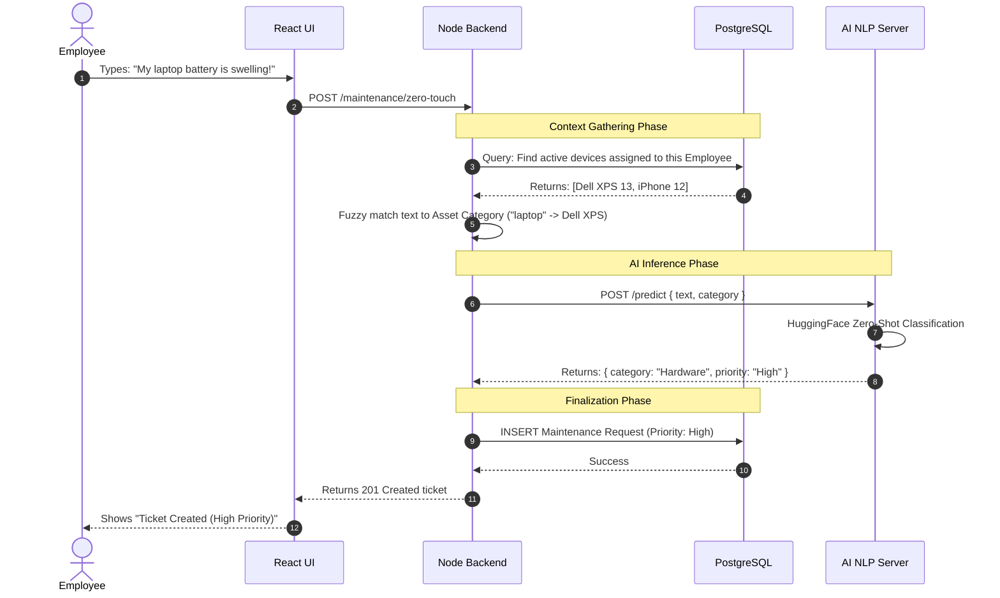
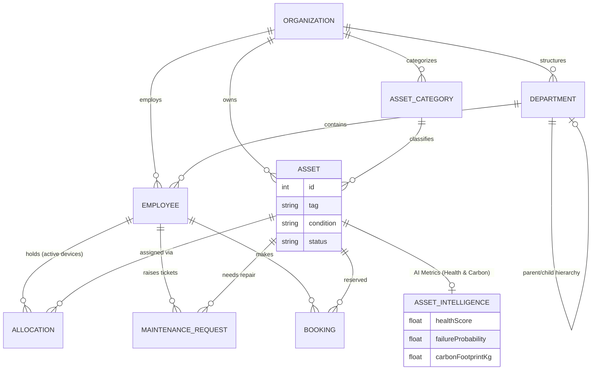

# AssetFlow & Zero-Touch AI Triage

**Enterprise Asset & Maintenance Management System with Autonomous AI**

> A full-stack web application for managing physical assets, tracking allocations, and running an autonomous Zero-Touch AI maintenance ticketing system. 
> Built with **React + Vite** (Frontend), **Node.js + Prisma + PostgreSQL** (Backend), and **Python + HuggingFace** (AI Model).

---

## 🏗️ High-Level System Architecture

The application is split into three main tiers, cleanly separating the user interface, business logic, and artificial intelligence layer.



---

## 🤖 Zero-Touch AI Triage Workflow

This sequence diagram illustrates exactly how the AI seamlessly processes natural language into structured database tickets without user intervention.



---

## 🗄️ Database Structure (ERD)

The system uses a highly normalized PostgreSQL database structure, managed by Prisma.



---

## 🌟 AI/ML + Full Stack: The Novelty & Innovation

What makes AssetFlow fundamentally different from legacy CRUD IT systems (like ServiceNow, Snipe-IT, or Jira)? AssetFlow bridges the gap between **Enterprise Full-Stack Architecture** and **Machine Learning Edge Computing**.

### 1. The Paradigm Shift: Zero-Touch AI Ticketing
Legacy platforms force users into "Decision Fatigue"—forcing them to fill out long forms, select complex Asset IDs from dropdowns, guess IT categories, and manually assign priorities. 
AssetFlow introduces **Zero-Touch Ticketing**:
- **Fuzzy Contextual Matching:** Employees simply type what is wrong in natural English (*"My screen shattered after I dropped my laptop"*). The Node.js backend automatically queries the relational database for the user's actively assigned devices and mathematically fuzzy-matches the context to figure out *which* device they are talking about.
- **Local AI/ML Predictive NLP:** Instead of making expensive, latency-heavy, and privacy-violating calls to 3rd-party Cloud LLMs (like OpenAI/ChatGPT), AssetFlow routes the text to a **Local Python FastAPI Edge Server**.
- **The Algorithm:** The ML server runs **HuggingFace's `facebook/bart-large-mnli`**, an advanced Zero-Shot Text Classification Neural Network. It natively understands the semantic context of the sentence to automatically predict the correct **Issue Category** (Hardware vs Software) and calculates the **Priority Level** (High, Medium, Low) in milliseconds.

### 2. Eco-Sustainability & Predictive Carbon Tracking
Traditional IT software stops at tracking *where* a laptop is. AssetFlow pioneers **Eco-Sustainability Tracking**:
- The database includes native telemetry for `baseCarbonFootprintKg` and `powerDrawWatts`.
- The `AssetIntelligence` module actively monitors the lifecycle of the device, continuously tracking the accumulated `carbonFootprintKg` for every single asset across the company. This AI/ML data helps IT administrators make data-driven, eco-friendly hardware purchasing decisions to achieve Carbon Net-Zero goals.

### 3. Algorithmic Risk & Failure Prediction Models
AssetFlow doesn't just react to broken devices—it mathematically predicts when they will break. 
- **Health Score Decay:** A deterministic mathematical algorithm calculates a live `healthScore` for every asset, derived dynamically from the device's exact `acquisitionDate` versus its category's `expectedLifespanMonths`.
- **Risk Prediction:** The system leverages historical maintenance frequencies and live condition degradation inputs to calculate a live `failureProbability` percentage. This empowers IT teams to shift from *Reactive Repair* to **Proactive Replacement**, minimizing catastrophic hardware downtime before it ever happens.

### 4. Mathematical Collision Prevention via PostgreSQL GiST
Standard web apps rely on "Application-Level" logic to prevent double-booking of resources (like meeting rooms or projectors), which frequently results in race-condition bugs during high traffic. 
AssetFlow innovates by pushing this validation directly to the Database Engine using a raw **PostgreSQL GiST EXCLUDE constraint**. This mathematically guarantees that no two `Booking` records can ever have overlapping `startTime` and `endTime` ranges—ensuring zero data corruption.

### 5. Local, Privacy-Preserving AI
Unlike modern wrappers that just send user data to OpenAI or Claude APIs, this project runs a **local Python FastAPI server** hosting the HuggingFace model. This means the AI inference happens locally, saving API costs and ensuring 100% data privacy for enterprise environments. No proprietary company ticketing data is ever sent to third-party LLM providers.

### 6. Hierarchical Departments & Granular RBAC
- **Hierarchical structure:** Departments can have parent and child relationships to mirror real-world corporate structures.
- **Role-Based Access Control (RBAC):** The database utilizes Prisma and robust Express middleware to enforce strict roles (ADMIN, ASSET_MANAGER, DEPARTMENT_HEAD, EMPLOYEE). Every API request cryptographically verifies the JWT token signatures.

---

## 🏢 Core Product Modules

AssetFlow is a fully comprehensive ERP for IT assets, encompassing several distinct workflows:

- **AI Maintenance Triage**: Employees submit issues in natural language. AI automatically assigns priority (High, Medium, Low) and categorization. Technicians pick up tickets and resolve them, transitioning the underlying asset to "Under Maintenance" state.
- **Resource Booking System**: Employees can book projectors, company cars, or meeting rooms. PostgreSQL guarantees double-bookings are mathematically impossible.
- **Audit Verification Cycles**: IT administrators can launch organization-wide Audits. Auditors physically verify the condition of assets (Missing, Verified, Damaged) using a dashboard, ensuring the database stays perfectly synced with reality.
- **Peer-to-Peer Asset Transfers**: If an employee leaves or changes departments, they can initiate a `TransferRequest` to seamlessly pass hardware ownership to another employee.

---

## 🔒 Database Connection & Security Architecture

The backbone of the application relies on an enterprise-grade security standard:

- **Supabase PostgreSQL & Prisma Connection Pooling**: The Node.js backend connects directly to a highly scalable PostgreSQL instance hosted on Supabase. To handle high traffic bursts, the Prisma ORM manages connection pooling natively, ensuring no connection leaks occur.
- **Stateless JWT Cryptography**: The application uses absolutely zero session cookies. When a user logs in, the backend uses `bcrypt` to compare password hashes, and then generates a highly secure JSON Web Token (JWT). The JWT is cryptographically signed using a strong `JWT_SECRET` string.
- **Express Middleware Security**: Every single route (except login/signup) passes through strict `requireAuth` and `requireRole` middleware. If an employee tries to access an Admin route, the middleware intercepts the JWT, checks the cryptographically signed `permissions` array, and throws a 403 Forbidden error before the database is ever queried.

---

## 🚀 How to Run the Entire System

You will need to open **3 separate terminal windows** to run the frontend, backend, and AI model simultaneously.

### Prerequisites
- Node.js 18+
- Python 3.10+
- PostgreSQL Database (Locally or via Supabase)

---

### Step 1: Run the Backend (Terminal 1)
The backend is an Express/TypeScript server that connects to the database.

```bash
cd server

# 1. Install dependencies
npm install

# 2. Make sure your .env is set up with DATABASE_URL
# Generate the Prisma client & sync DB
npm run db:generate
npm run db:push

# 3. Start the server
npm run dev
```
> The API will be running at **http://localhost:3001**

---

### Step 2: Run the Frontend (Terminal 2)
The frontend is a React application built with Vite and styled with Tailwind CSS.

```bash
cd client

# 1. Install dependencies
npm install

# 2. Start the Vite dev server
npm run dev
```
> The UI will be running at **http://localhost:5173**

---

### Step 3: Run the AI Model (Terminal 3)
The AI Model is a Python FastAPI server that uses PyTorch and HuggingFace Transformers.

```bash
cd ai_triage_model

# Run the provided batch script (Windows)
# NOTE: In PowerShell, you must prefix it with .\
.\start_model.bat
```
*(If the `.bat` file doesn't work, you can manually run it):*
```bash
python -m venv venv
.\venv\Scripts\activate
pip install -r requirements.txt
python run_model.py
```
> The AI Model API will be running at **http://localhost:8000**

---

## 🛠️ Tech Stack

| Layer | Technology | Purpose |
|---|---|---|
| **AI NLP Model** | Python, FastAPI, HuggingFace (`facebook/bart-large-mnli`) | Local Zero-Shot Classification for Ticket Routing |
| **Backend** | Node.js, Express, TypeScript | REST API and Business Logic |
| **Database ORM** | Prisma | Type-safe queries and schema migrations |
| **Database** | PostgreSQL | Relational data storage, GiST EXCLUDE ranges |
| **Frontend** | React, Vite, TypeScript | Lightning-fast development and UI rendering |
| **Styling** | Tailwind CSS | Modern, responsive, utility-first design system |
| **Auth** | JWT, bcrypt | Custom cryptographic stateless authentication |
