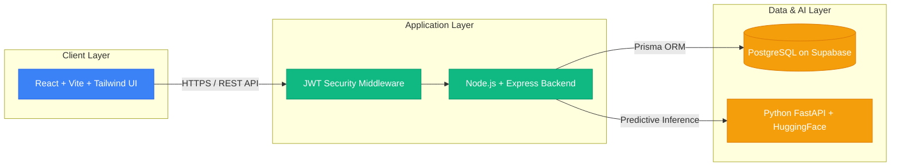
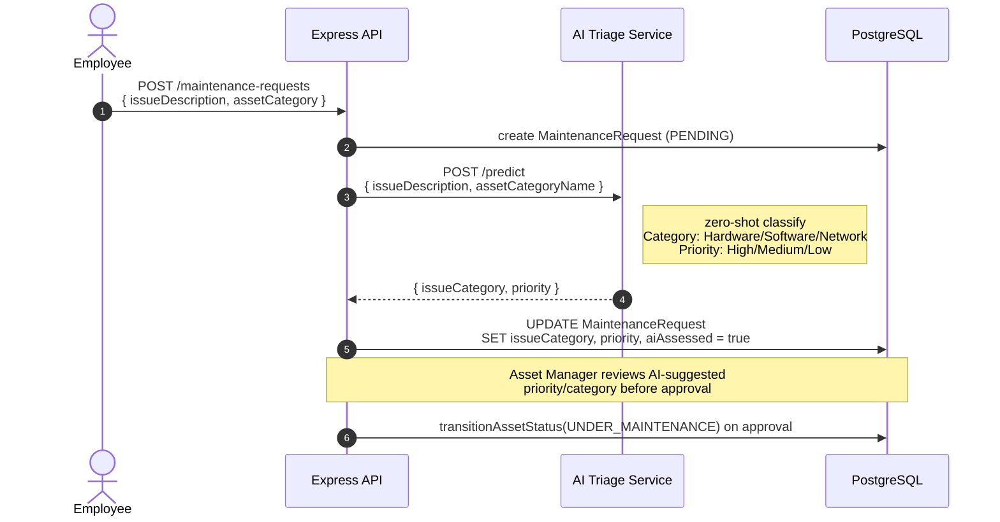
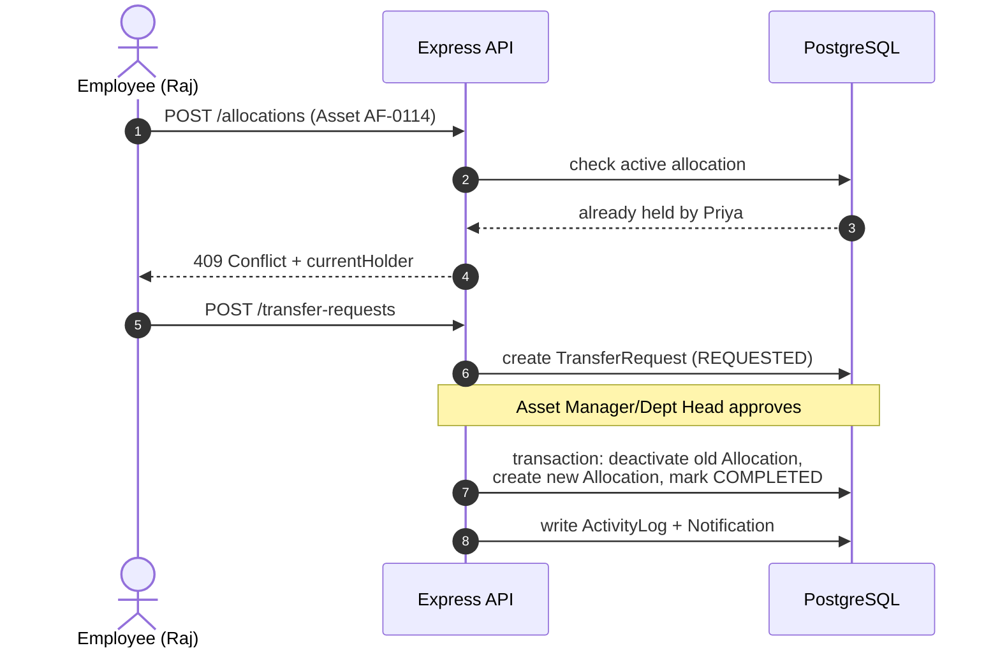
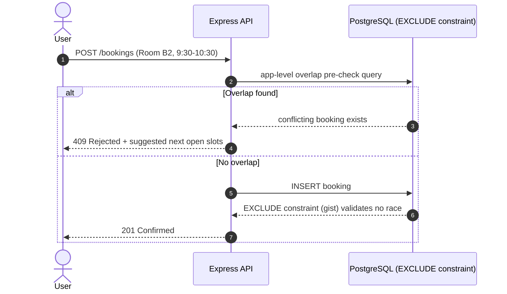
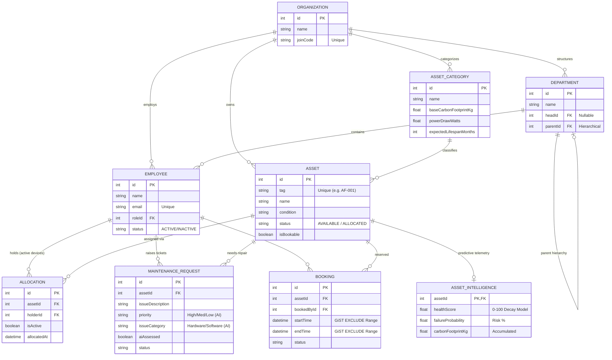

# AssetFlow & Zero-Touch AI Triage

**Enterprise Asset & Maintenance Management System with Autonomous AI**

AssetFlow is an enterprise-grade, multi-tenant Full-Stack web application architected for large-scale physical asset lifecycle management, dynamic allocation tracking, and advanced resource booking. It integrates a cutting-edge **Zero-Touch AI Maintenance Ticketing System** designed to eliminate manual triage overhead in modern IT and facilities departments. 

By bridging standard CRUD operations with **Local Edge Machine Learning (NLP)**, AssetFlow intelligently parses unstructured natural language reports from employees and autonomously categorizes issues, assigns priority levels, and predicts hardware failure probabilities before they occur. 

**Industry Application:** At an enterprise scale, IT Helpdesks waste thousands of hours manually routing, categorizing, and prioritizing hardware tickets. AssetFlow's AI-driven pipeline acts as a fully autonomous Level-1 IT Dispatcher. Combined with its PostgreSQL GiST constraints for mathematical double-booking prevention and dynamic carbon footprint telemetry, AssetFlow provides CTOs and Asset Managers with a highly robust, scalable, and eco-conscious system to optimize hardware longevity and reduce operational bottlenecks.

Built with **React + Vite** (Frontend), **Node.js + Prisma + PostgreSQL** (Backend), and **Python + HuggingFace** (AI Model).

---

## High-Level System Architecture

The application is split into three main tiers, cleanly separating the user interface, business logic, and artificial intelligence layer.



---

## Detailed Workflow Sequences

### 1. AI-Assisted Maintenance Triage
This sequence demonstrates how the AI processes natural language into structured database tickets without user intervention, while allowing an Asset Manager to review the output.



### 2. Allocation Conflict -> Transfer Request
This sequence shows how the system prevents allocation conflicts by forcing a peer-to-peer Transfer Request if an asset is already owned by someone else.



### 3. Resource Booking Overlap Check
This sequence illustrates how PostgreSQL mathematically prevents booking collisions at the database level.



---

## Multi-Tenant B2B SaaS & Role-Based Access Architecture (RBAC)

AssetFlow is not just built for a single company; it is architected from the ground up as a scalable **B2B SaaS (Software as a Service) Platform**. This allows a single deployment to host hundreds of distinct companies, generating significant recurring software revenue (MRR/ARR) for the platform owner.

### 1. Multi-Organization Scoping (B2B SaaS Isolation)
Every single query in the Express API is strictly bound by a cryptographic `organizationId`. 
- **Data Isolation:** An employee at "TechCorp" cannot read, write, or even query assets, bookings, or tickets belonging to "DiagCorp". This multi-tenant isolation is enforced globally at the database schema level.
- **Industry Profitability:** Because the infrastructure is shared but the data is securely isolated, hosting costs remain extremely low while the platform can be monetized and sold on a subscription basis to multiple enterprises simultaneously.

### 2. Strict RBAC Middleware
Express middleware decodes and verifies cryptographically signed JWTs to enforce Role-Based Access within each organization.
- **ADMIN:** Full system configuration access.
- **ASSET_MANAGER:** Can approve Transfer Requests, review AI Maintenance tickets, and oversee audits.
- **DEPARTMENT_HEAD:** Can view and manage physical assets strictly within their department's hierarchy.
- **EMPLOYEE:** Can only view their personal allocated hardware and create maintenance tickets.

---

## Database Structure (ERD)

The system uses a highly normalized PostgreSQL database structure, managed by Prisma.



---

## AI/ML + Full Stack: Architecture

AssetFlow bridges the gap between **Enterprise Full-Stack Architecture** and **Machine Learning Edge Computing**.

### 1. Zero-Touch AI Ticketing
AssetFlow introduces **Zero-Touch Ticketing**:
- **Fuzzy Contextual Matching:** Employees type issues in natural English (*"My screen shattered after I dropped my laptop"*). The Node.js backend automatically queries the relational database for the user's actively assigned devices and mathematically fuzzy-matches the context to figure out *which* device they are talking about.
- **Local AI/ML Predictive NLP:** AssetFlow routes the text to a **Local Python FastAPI Edge Server**.
- **The Algorithm:** The ML server runs **HuggingFace's `facebook/bart-large-mnli`**, an advanced Zero-Shot Text Classification Neural Network. It natively understands the semantic context of the sentence to automatically predict the correct **Issue Category** (Hardware vs Software) and calculates the **Priority Level** (High, Medium, Low) in milliseconds.

### 2. Eco-Sustainability & Predictive Carbon Tracking
AssetFlow provides **Eco-Sustainability Tracking**:
- The database includes native telemetry for `baseCarbonFootprintKg` and `powerDrawWatts`.
- The `AssetIntelligence` module actively monitors the lifecycle of the device, continuously tracking the accumulated `carbonFootprintKg` for every single asset across the company. 

### 3. Algorithmic Risk & Failure Prediction Models
AssetFlow mathematically predicts when devices will break.
- **Health Score Decay:** A deterministic mathematical algorithm calculates a live `healthScore` for every asset, derived dynamically from the device's exact `acquisitionDate` versus its category's `expectedLifespanMonths`.
- **Risk Prediction:** The system leverages historical maintenance frequencies and live condition degradation inputs to calculate a live `failureProbability` percentage. This shifts operations from *Reactive Repair* to **Proactive Replacement**.

### 4. Mathematical Collision Prevention via PostgreSQL GiST
AssetFlow innovates by pushing validation directly to the Database Engine using a raw **PostgreSQL GiST EXCLUDE constraint**. This mathematically guarantees that no two `Booking` records can ever have overlapping `startTime` and `endTime` ranges.

### 5. Local, Privacy-Preserving AI
This project runs a **local Python FastAPI server** hosting the HuggingFace model. This means the AI inference happens locally, saving API costs and ensuring 100% data privacy for enterprise environments. No proprietary company ticketing data is ever sent to third-party LLM providers.

### 6. Hierarchical Departments & Granular RBAC
- **Hierarchical structure:** Departments can have parent and child relationships to mirror real-world corporate structures.
- **Role-Based Access Control (RBAC):** The database utilizes Prisma and robust Express middleware to enforce strict roles (ADMIN, ASSET_MANAGER, DEPARTMENT_HEAD, EMPLOYEE). Every API request cryptographically verifies the JWT token signatures.

---

## Core Product Modules

AssetFlow is an ERP for IT assets, encompassing several distinct workflows:

- **AI Maintenance Triage**: Employees submit issues in natural language. AI automatically assigns priority (High, Medium, Low) and categorization. Technicians pick up tickets and resolve them, transitioning the underlying asset to "Under Maintenance" state.
- **Resource Booking System**: Employees can book projectors, company cars, or meeting rooms. PostgreSQL guarantees double-bookings are mathematically impossible.
- **Audit Verification Cycles**: IT administrators can launch organization-wide Audits. Auditors physically verify the condition of assets (Missing, Verified, Damaged) using a dashboard, ensuring the database stays perfectly synced with reality.
- **Peer-to-Peer Asset Transfers**: If an employee leaves or changes departments, they can initiate a `TransferRequest` to seamlessly pass hardware ownership to another employee.

---

## Database Connection & Security Architecture

The backbone of the application relies on an enterprise-grade security standard:

- **Supabase PostgreSQL & Prisma Connection Pooling**: The Node.js backend connects directly to a highly scalable PostgreSQL instance hosted on Supabase. To handle high traffic bursts, the Prisma ORM manages connection pooling natively, ensuring no connection leaks occur.
- **Stateless JWT Cryptography**: The application uses absolutely zero session cookies. When a user logs in, the backend uses `bcrypt` to compare password hashes, and then generates a highly secure JSON Web Token (JWT). The JWT is cryptographically signed using a strong `JWT_SECRET` string.
- **Express Middleware Security**: Every single route (except login/signup) passes through strict `requireAuth` and `requireRole` middleware. If an employee tries to access an Admin route, the middleware intercepts the JWT, checks the cryptographically signed `permissions` array, and throws a 403 Forbidden error before the database is ever queried.

---

## How to Run the Entire System

You will need to open **3 separate terminal windows** to run the frontend, backend, and AI model simultaneously.

### Prerequisites
- Node.js 18+
- Python 3.10+
- PostgreSQL Database (Locally or via Supabase)

---

### Step 1: Run the Backend (Terminal 1)
The backend is an Express/TypeScript server that connects to the database.

```bash
cd server

# 1. Install dependencies
npm install

# 2. Make sure your .env is set up with DATABASE_URL
# Generate the Prisma client & sync DB
npm run db:generate
npm run db:push

# 3. Start the server
npm run dev
```
> The API will be running at **http://localhost:3001**

---

### Step 2: Run the Frontend (Terminal 2)
The frontend is a React application built with Vite and styled with Tailwind CSS.

```bash
cd client

# 1. Install dependencies
npm install

# 2. Start the Vite dev server
npm run dev
```
> The UI will be running at **http://localhost:5173**

---

### Step 3: Run the AI Model (Terminal 3)
The AI Model is a Python FastAPI server that uses PyTorch and HuggingFace Transformers.

```bash
cd ai_triage_model

# Run the provided batch script (Windows)
# NOTE: In PowerShell, you must prefix it with .\
.\start_model.bat
```
*(If the `.bat` file doesn't work, you can manually run it):*
```bash
python -m venv venv
.\venv\Scripts\activate
pip install -r requirements.txt
python run_model.py
```
> The AI Model API will be running at **http://localhost:8000**

---

## Tech Stack

| Layer | Technology | Purpose |
|---|---|---|
| **AI NLP Model** | Python, FastAPI, HuggingFace (`facebook/bart-large-mnli`) | Local Zero-Shot Classification for Ticket Routing |
| **Backend** | Node.js, Express, TypeScript | REST API and Business Logic |
| **Database ORM** | Prisma | Type-safe queries and schema migrations |
| **Database** | PostgreSQL | Relational data storage, GiST EXCLUDE ranges |
| **Frontend** | React, Vite, TypeScript | Lightning-fast development and UI rendering |
| **Styling** | Tailwind CSS | Modern, responsive, utility-first design system |
| **Auth** | JWT, bcrypt | Custom cryptographic stateless authentication |ryptographic stateless authentication |
